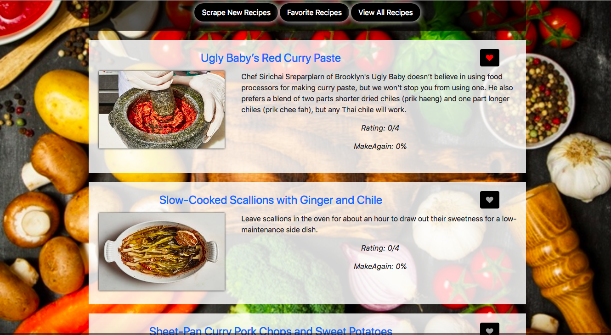
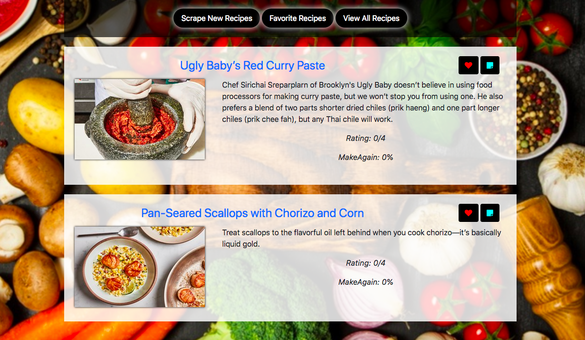

# Recipes-Scraper

## About
This application scrapes www.epicurious.com for their recently added recipes. Once data is scraped, it is stored as documents on MongoDB database with some added keys. User can add recipes/save recipes to favorites. Also, user can add/update notes for each of his saved recipes. User can re-scrape the website for fresh recipes and that will add newly added recipes to the collection.


## Deployed Link
[Recipe-Scraper](https://kitchen-scraper.herokuapp.com/)

## Application Preview
### View All Recipes

### View Favorite Recipes


## Technologies used
1. Node.js
2. Express
3. Handlebars
4. MongoDB (NoSQL)
5. Web Scraping

## Node Packages used
1. express
    * usage
    ```require("express")```
    * It is a fast, unopinionated, minimalist web framework for node.
    * For more information: [express](https://expressjs.com)

2. body-parser
    * usage
    ```require("body-parser")```
    * Node.js body parsing middleware.Parses incoming request bodies in a middleware before handlers, available under the req.body property.
    * For more information: [body-parser](https://www.npmjs.com/package/body-parser)

3. express-handlebars
    * usage
    ```require("express-handlebars")```
    *  lets one build semantic templates effectively. It is logic-less and keeps the views and logic separated.
    * For more information: [express-handlebars](https://www.npmjs.com/package/express-handlebars)

4. request
    * usage
    ```require("request")```
    * request package is used to send requests to the websites for data scraping and receive the response from them.
    * For more information: [request](https://www.npmjs.com/package/request)

5. mongoose
    * usage
    ```require("mongoose")```
    * mongoose is a MongoDB object modeling tool designed to work in an asynchronous environment.
    * For more information: [mongoose](https://www.npmjs.com/package/mongoose)

6. cheerio
    * usage
    ```require("cheerio")```
    * Cheerio parses markup and provides an API for traversing/manipulating the resulting data structure. It does not interpret the result as a web browser does. Specifically, it does not produce a visual rendering, apply CSS, load external resources, or execute JavaScript.
    * For more information: [cheerio](https://www.npmjs.com/package/cheerio)

## Execution steps on local machine
1. Make sure node is installed on your machine. You can visit the website [Node Installation](http://blog.teamtreehouse.com/install-node-js-npm-mac) for instructions.
2. Download/Clone the respository.
3. On terminal, go inside Recipes-Scraper folder and type npm install. This will install all the dependencies required to run the application mentioned in package.json.
4. Make sure MongoDB is installed and configured on the localhost. 
Run `brew install mongodb --with-openssl` in your root directory on terminal to install it on your Mac.
Then execute these commands `sudo mkdir -p /data/db` and `sudo chmod go+w /data/db` to configure it.
5. Start mongod process on terminal.
6. Inside Recipes-Scraper folder on terminal, type "node server.js" on terminal. This will start the server.
7. Open the browser and type "localhost:8080". This will start executing the client part of the application.

## Code snippets

### server
```
//Initialize express
var app = express();

// Requiring our models for syncing
var db = require("./models");

// Serve static content for the app from the "public" directory in the application directory.
app.use(express.static("public"));

// parse application/x-www-form-urlencoded
app.use(bodyParser.urlencoded({ extended: true }));

// parse application/json
app.use(bodyParser.json());

// Set Handlebars.
var exphbs = require("express-handlebars");

app.engine("handlebars", exphbs({ defaultLayout: "main" }));
app.set("view engine", "handlebars");

// Connect to the Mongo DB
// If deployed, use the deployed database. Otherwise use the local mongoHeadlines database
var MONGODB_URI = process.env.MONGODB_URI || "mongodb://localhost/recipe-scraper";

// Set mongoose to leverage built in JavaScript ES6 Promises
// Connect to the Mongo DB
mongoose.Promise = Promise;
mongoose.connect(MONGODB_URI);
```
Above code shows how to configure the required packages.

```
app.get("/scrape", function(req, res) {
    // Make a request call to grab the HTML body from the site
    request("https://www.epicurious.com/search/?content=recipe&sort=newest", function(error, response, html) {

        //load that into cheerio and save it to $ for a shorthand selector
        var $ = cheerio.load(html);

        //get the number of recipes that we would be extracting from the website
        var len = $("article.recipe-content-card").length;

        //for each recipe card in the html
        $("article.recipe-content-card").each(function(i, element) {

            var title = $(element).children("header.summary").children("h4.hed").children().text();
            var summary = $(element).children("header.summary").children("p.dek").text();
            var rating = $(element).children("header.summary").find("dd.rating").children("span").eq(0).text();
            var makeagain = $(element).children("header.summary").find("dd.make-again-percentage").text();
            makeagain=makeagain.slice(0,makeagain.length-1);
            var link = "https://www.epicurious.com"+$(element).children("a.photo-link").attr("href");

            //since picture was dynamically generated on this page and could not be scraped,
            //To get the picture another request is made to the recipe link page
            request(link, function(error,response,html){
                var $ = cheerio.load(html);
                var image = $("img.photo.loaded").attr("srcset");

                //empty object that will be used to make recipe object
                var result ={};
                
                //add all scraped values to the object result
                result.title= title,
                result.summary=summary,
                result.rating=parseInt(rating),
                result.makeagain= parseInt(makeagain),
                result.link=link,
                result.image=image
                
                // Create a new Recipe using the `result` object built from scraping
                db.Recipe.create(result).then(function(dbRecipe) {
                    // View the added result in the console
                    console.log(dbRecipe);
            
                    //If all recipes are created in database, redirect to root route and display all the recipes from the database
                    if(i === len-1)
                        res.redirect("/");
                }).catch(function(err) {
                    return res.json(err);
                });
            });
        })
    });
});
```
Above code snippet makes a request to the website and gets back the html in response. Cheerio is used to parse it and then manipulate it to get hold of the required values. In this case, since image was getting rendered dunamically, image could not be grabbed. So, we made another request to the recipe page and grabbed the image source from that page. Once we had all the information for a recipe, we inserted it into Recipe collection. We repeat this process until all the recipes on the page are inserted in the collection. After that, we redirect to the root route that displays all the data from Recipe collection.

```
app.get("/", function(req, res) {
    db.Recipe.find({}).then(function(dbData){
        res.render("index",{recipes:dbData})
      }).catch(function(err){
        res.json(err);
      })
});
```
Above code snippet gets all data from Recipe collection and renders index.handlebars with data in response.

```
app.get("/favorites", function(req, res) {
    db.Recipe.find({favorite:true}).then(function(dbData){
        res.render("favorites",{recipes:dbData})
    }).catch(function(err){
        res.json(err);
    })
});
```
Above code snippet gets all data from Recipe collection that user has marked as favorites and renders favorites.handlebars with data in response.

```
app.get("/recipes/:recipeID/notes", function(req, res) {
    db.Recipe.findOne({"_id": req.params.recipeID}).populate("note").then(function(dbData){
      res.json(dbData)
    }).catch(function(err){
      res.json(err);
    })
  });
```
Above code finds a particular Recipe alomg with its note populated and returns the data found in response.

```
app.post("/recipes/:recipeID/notes", function(req, res) {
    db.Note.create(req.body).then(function(dbNote){
      return db.Recipe.findOneAndUpdate({"_id":req.params.recipeID}, { $set: { note: dbNote._id } }, { new: true });
    }).then(function(dbRecipe) {
      res.json(dbRecipe);
    })
    .catch(function(err) {
      res.json(err);
    });
});
```
Above code creates/updates user's note for a particular recipe from his favorite recipes. Here, first a note is added to the note collection and then it's id is added to note key of that recipe document.

```
app.post("/recipes/:recipeID", function(req,res){
    db.Recipe.findOneAndUpdate({"_id":req.params.recipeID}, {$set:{ favorite: req.body.favorite }}, { new: true })
    .then(function(dbRecipe){
        res.json(dbRecipe);
    })
    .catch(function(err){
        res.json(err);
    });
});
```
Above code adds/removes a recipe from user's favorites section. It updates a paticular document in the recipe collection.

### model
#### Recipe Schema:
```
// Using the Schema constructor, create a new UserSchema object

var RecipeSchema = new Schema({
  title: {
    type: String,
    required: true,
    unique:true
  },
  summary: {
    type: String,
    required: true
  },
  rating: {
      type: Number
  },
  makeagain: {
      type: Number
  },
  link: {
      type: String,
      required:true
  },
  image : {
    type: String,
    required:true
  },
  favorite: {
    type: Boolean,
    default: false
  },
  note: {
    type: Schema.Types.ObjectId,
    ref: "Note"
  }
});

// This creates our model from the above schema, using mongoose's model method
var Recipe = mongoose.model("Recipe", RecipeSchema);
```
Title is the title of the recipe, summary is a short summary about the recipe, rating is an integer which would be between 0-4 in this case, makeagain is an integer between 0-100 which shows what percentage of reviewers voted that they would make this recipe again, link stores the link to the recipe page, image stores the source of the recipe image. All these data are grabbed from the website by scraping it. We added few more keys to it: favorite: If user has marked this recipe in his favorites or not and notes which will contain the id of the notes model related to this particular recipe. ID will be automatically generated.

#### Note Schema:
```
var NoteSchema = new Schema({
  body: String
});

// This creates our model from the above schema, using mongoose's model method
var Note = mongoose.model("Note", NoteSchema);
```
Note collection will contain only one key body which will store the note contents; ID will be automatically generated.

### Client
```
$(document).on("click",".add-a-note", function(){
    $("#bodyinput").val("");
    var recipeID = $(this).attr("data-id");;
    $.ajax({
        method: "GET",
        url: "/recipes/" + recipeID +"/notes"
    }).then(function(data) {
          $("#exampleModalLongTitle").html("<h4>" + data.title + "</h4>")
          $("#savenote").attr("data-id",data._id)
          if (data.note) 
            $("#bodyinput").val(data.note.body);
    });
})
```
When Note button is clicked for a recipe, a get request is made to the server to get the note data associated with that recipe. It then loads a modal with the retreived data and displays the modal. If no data is retreived, modal body is empty.

```
$(document).on("click", "#savenote", function() {
    var noteData =  $("#bodyinput").val();
    $("#exampleModalCenter").modal('hide');
    var recipeId = $(this).attr("data-id");
    $.ajax({
      method: "POST",
      url: "/recipes/" + recipeId+ "/notes",
      data: {
        body: noteData
      }
    }).then(function(data) {
        console.log(data);
      });
    $("#bodyinput").val("");
  });
```
When Save note button is clicked for a particular recipe, we post it to the database and update the note for that recipe.

```
$(document).on("click",".add-to-favorites", function(){
    $(this).removeClass("add-to-favorites");
    $(this).addClass("added-to-favorites");
    var recipeId = $(this).data("id");
    $.ajax({
        method: "POST",
        url: "/recipes/" + recipeId,
        data: {
          favorite: true
        }
      })
})
```
Above code is executed when user clicks on favorite button to mark it as favorite. We change the class and then make a post request to update the favorite key of that particular recipe to true. Removing the recipe from favorites would work the similar way.

## Learning points
1. Creating a full stack web application.
2. Learning how the server and client interact with requests and responses.
3. How to create a server and how it starts listening for the clients' requests on a particular port.
4. How the models, controllers and views interact in MVC architecture.
5. Various types of ajax client requests i.e post,get,put,delete to database server
6. Sending various types of responses to clients including serving an html page/handlebar or sending back data as json object.
7. Modular front-end using handlebars.
8. How to query using a req.body or req.params
9. Using mongoose package to interact with mongoDB. This included creating connection, querying and using results in callback.
10. How is associate models in mongoDB.


## Author 
* [Ajita Srivastava Github](https://github.com/ajitas)
* [Ajita Srivastava Portfolio](https://ajitas.github.io/Portfolio/)

## License
Standard MIT License


